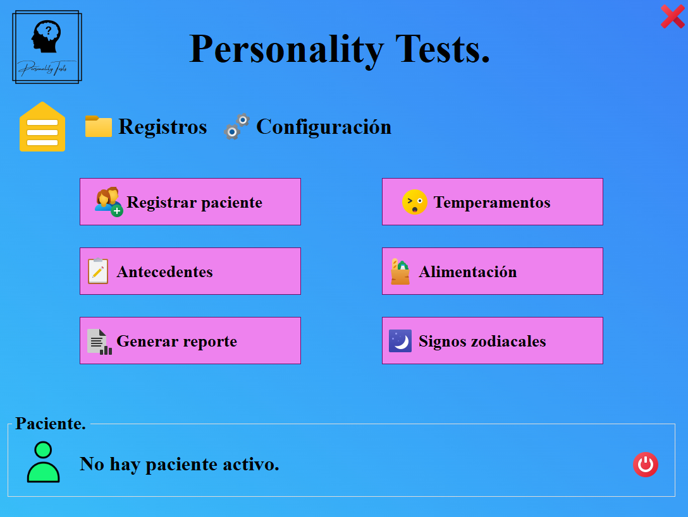

# 🧠 Personality Tests

---

## 🇪🇸 Español

### Descripción del Proyecto

**Personality Tests** es una **aplicación de escritorio** diseñada para la **realización digital y gestión de pruebas de psicología personal**. Su objetivo es servir como un punto de partida eficiente para psicólogos antes de iniciar sesiones con nuevos pacientes, ayudando a ahorrar recursos como papel y tinta al realizar las evaluaciones de forma digital.

El proyecto fue desarrollado para el **Lic. Martín Reyes**.

### Características Principales

* **Digitalización de Pruebas:** Aplica evaluaciones psicológicas de personalidad directamente en la aplicación.
* **Gestión de Datos:** Permite el registro de nuevos pacientes, consulta de antecedentes y gestión de la configuración.
* **Generación de Reportes:** Capacidad para generar informes basados en los resultados de los tests.
* **Módulos de Evaluación:** Incluye secciones como Temperamentos, Alimentación y Signos Zodiacales.

### Menú Principal

La siguiente imagen ilustra el menú principal de la aplicación.

---

## 🇺🇸 English

### Project Description

**Personality Tests** is a **Desktop Application** designed for the **digital implementation and management of personal psychology tests**. Its purpose is to serve as an efficient starting point for psychologists before beginning sessions with new patients, helping to save resources like paper and ink by performing tests digitally.

The project was developed for **Lic. Martín Reyes**.

### Key Features

* **Test Digitalization:** Apply personality psychological assessments directly within the application.
* **Data Management:** Allows for new patient registration, antecedent consultation, and configuration management.
* **Report Generation:** Capability to generate detailed reports based on the test results.
* **Evaluation Modules:** Includes sections such as Temperaments, Diet/Nutrition, and Zodiac Signs.

### Main Menu

The following image illustrates the main application menu.

---

## 🛠️ Tools & Technologies | Herramientas y Tecnologías

| Categoría | Category | Herramienta / Tecnología | Tool / Technology |
| :--- | :--- | :--- | :--- |
| **Lógica de Aplicación / Frontend** | Application Logic / Frontend | Visual Basic | Visual Basic |
| **Base de Datos** | Database | MySQL | MySQL |
| **Control de Versiones** | Version Control | Git | Git |
| **Plataforma de Alojamiento** | Hosting Platform | GitHub | GitHub |

---

## 📅 Project Details | Detalles del Proyecto

* **Type:** Desktop Application
* **Tipo:** Aplicación de Escritorio
* **Client / Cliente:** Lic. Martin Reyes
* **Date / Fecha:** December 9th, 2022

---
